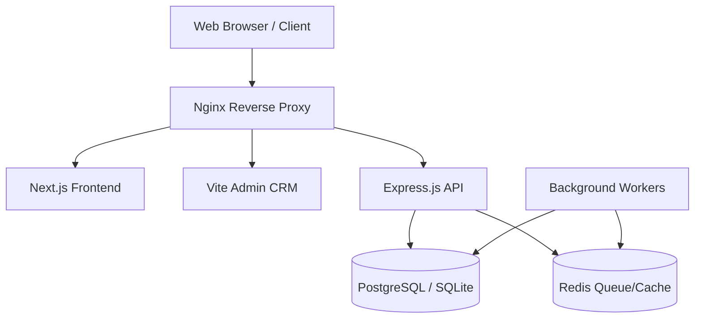

# Manav Rachna Time

A full-stack Content Management System (CMS) and Customer Relationship Management (CRM) platform built for content publishing, media management, and administrative control.

---

## Overview

Manav Rachna Time is a modern, modular web application designed to handle digital content publishing. It provides a robust backend API for managing articles, media, and user roles, a Next.js-based frontend for content consumption, and a dedicated React-based Admin CRM for administrative operations.

The system solves the problem of managing editorial workflows by offering role-based access control, article revision history, automated media processing, and configurable homepage layouts, all deployed via a scalable infrastructure.

---

## Key Features

### Content Management
- **Article Publishing**: Draft, schedule, and publish news articles.
- **Revision History**: Track changes across article versions.
- **Categorization & Tagging**: Organize content hierarchically.
- **Dynamic Homepage Grids**: Configurable layout and ordering for featured content.

### Authentication & Authorization
- **JWT-Based Auth**: Secure authentication with short-lived access tokens and secure, HTTP-only refresh tokens.
- **Basic Role-Based Access Control (RBAC)**: Enforced basic role checks (e.g., admin, editor) for protected endpoints.
- **Session Management**: Track and manage active user sessions and login history.
- **Security Lockouts**: Automatic rate limiting and temporary lockouts for failed login attempts.

### Media Management
- **Automated Processing**: Image resizing and format conversion (WebP, AVIF) using Sharp.
- **Magic Byte Validation**: Deep inspection of file signatures (first 12 bytes) to securely prevent malicious uploads.
- **Variant Generation**: Automatic generation of thumbnails and responsive image sizes.

### Security & Auditing
- **Active Audit Logging**: System automatically tracks and logs database interactions (creates, updates, deletes) to the `AuditLog` table.
- **Automated Background Backups**: Incremental database backups execute safely in the background via BullMQ cron jobs.

### User Experience
- **Responsive Frontend**: Server-side rendered (SSR) Next.js application tailored for reading experiences.
- **Admin CRM**: A distinct Vite/React single-page application for editorial staff, featuring rich text editing (React Quill).
- **SEO Optimization**: Configurable meta titles, descriptions, canonical URLs, and social sharing images per article.

### Performance
- **Image Optimization**: On-the-fly image optimization and modern format serving.
- **Redis Integration**: Background job queues (BullMQ) offloading heavy tasks to prevent API blocking.
- **Next.js Turbopack**: Fast frontend development and optimized production builds.

### Deployment
- **Containerization**: Docker support for both API and worker processes.
- **Process Management**: PM2 ecosystem configuration for graceful restarts and process segregation (Cluster API + Fork Workers).
- **Automated Workflows**: GitHub Actions CI/CD pipelines targeting Azure (Backend) and Vercel (Admin CRM). *(Note: Next.js frontend CI/CD is managed separately).*
- **Reverse Proxy**: Nginx configuration for request routing, strict rate limiting, and static file serving.

---

## Screenshots

*(Placeholders for future screenshots)*

- **Homepage**: ``
- **Article Page**: ``
- **Admin Dashboard**: ``
- **Article Editor**: ``
- **Mobile View**: ``

---

## Architecture

The system follows a decoupled architecture separating the consumer-facing frontend, the editorial admin interface, and the backend API.



**Request Flow**:
1. Client requests hit the Nginx reverse proxy.
2. Nginx routes traffic to the Next.js frontend (port 3000), Admin CRM, or Express API (port 8080) based on the path.
3. The Express API handles business logic, querying the database via Prisma ORM and enqueuing heavy tasks (like image processing) to Redis.
4. Background workers consume Redis queues for asynchronous processing.

---

## Tech Stack

| Layer | Technology | Purpose |
| --- | --- | --- |
| **Frontend** | Next.js 15, React 19 | Server-side rendered consumer application |
| **Admin CRM** | Vite, React 18, React Router | Client-side rendered editorial dashboard |
| **Styling** | Tailwind CSS, Radix UI | Utility-first styling and accessible UI primitives |
| **Backend API** | Node.js, Express.js | Core API and business logic handling |
| **Database ORM**| Prisma ORM | Type-safe database queries and schema management |
| **Database** | PostgreSQL / SQLite | Primary relational data storage |
| **Caching/Queue**| Redis (BullMQ) | Background task processing and caching |
| **Infrastructure**| PM2, Docker, Nginx | Process management, containerization, and routing |

---

## Folder Structure

```text
.
├── backend/                  # Core Express API and Workers
│   ├── prisma/               # Database schema and migrations
│   ├── src/                  
│   │   ├── config/           # Environment and DB configuration
│   │   ├── controllers/      # Route handlers
│   │   ├── middleware/       # Auth, error, and security middleware
│   │   ├── models/           # Data models (if bypassing Prisma)
│   │   ├── routes/           # Express API route definitions
│   │   ├── services/         # Business logic
│   │   └── workers/          # Background job processors
│   └── ecosystem.config.js   # PM2 configuration
├── frontend/                 # Consumer-facing Next.js application
│   ├── admin-crm/            # Vite/React Admin Dashboard
│   ├── src/                  
│   │   ├── app/              # Next.js App Router pages
│   │   ├── components/       # Reusable React components
│   │   ├── hooks/            # Custom React hooks
│   │   └── lib/              # Utility functions
│   └── tailwind.config.ts    # Tailwind CSS configuration
├── nginx/                    # Nginx reverse proxy configuration
└── .github/workflows/        # CI/CD pipelines
```

---

## Authentication & Authorization

Authentication is managed via a dual-token JWT flow:
1. **Login**: Users authenticate using their email and bcrypt-hashed password.
2. **Access Token**: A short-lived JWT is returned in the JSON payload, used in the `Authorization: Bearer <token>` header for API requests.
3. **Refresh Token**: A long-lived, cryptographically secure token is stored in an `HttpOnly`, `Strict` cookie (`mrt_refresh_token`). It is used to request new access tokens upon expiration.

Authorization is enforced via Basic Role-Based Access Control (RBAC):
- Users are assigned roles (e.g., Admin, Editor).
- Middleware validates user roles against allowed groups before permitting access to protected endpoints.

---

## Security

- **Helmet**: Secures Express apps by setting various HTTP headers.
- **Rate Limiting**: `express-rate-limit` prevents brute-force attacks globally, alongside strict Nginx limits on authentication routes.
- **Failed Login Lockout**: Tracks failed attempts and locks accounts temporarily to mitigate credential stuffing.
- **Input Sanitization**: Utilizes `sanitize-html` to clean request bodies and prevent XSS injections.
- **Secure Cookies**: Refresh tokens are stored securely to mitigate XSS exposure.
- **Password Hashing**: Passwords are cryptographically hashed using bcrypt with configurable salt rounds.

---

## Performance

- **Server-Side Rendering (SSR)**: Next.js pre-renders pages for faster initial loads and SEO indexing.
- **Image Optimization**: Uploaded images are processed via Sharp into modern, lightweight formats (WebP, AVIF).
- **Background Processing**: Heavy tasks (media processing, cron jobs, backups) are offloaded to Redis-backed worker processes using BullMQ.
- **Database Indexing**: Prisma schema defines explicit indexes on frequently queried fields (e.g., slugs, publish dates, status) for optimized query execution.

---

## Deployment

The application is configured for deployment on a Virtual Private Server (VPS) using PM2, with automated CI/CD fallback to PaaS providers.

**Workflow**:
1. **Version Control**: Code is pushed to GitHub.
2. **CI/CD**: GitHub Actions workflows trigger builds and deployments for the Backend (Azure) and Admin CRM (Vercel).
3. **Process Management**: On a VPS, PM2 manages the Node.js processes. `ecosystem.config.js` defines:
   - `mrt-api`: Express API running in cluster mode to utilize all CPU cores.
   - `mrt-workers`: Background job processors running in fork mode.
   - `mrt-frontend`: Next.js frontend serving the consumer site.
4. **Proxy**: Nginx listens on port 80/443, handling SSL termination and proxying traffic to the respective PM2-managed services.

---

## Local Development

### Prerequisites
- Node.js (v20.x recommended)
- npm
- Redis server running locally

### Installation

1. **Clone the repository:**
   ```bash
   git clone <repository-url>
   cd smeh_new_desing
   ```

2. **Install dependencies:**
   The root `package.json` provides scripts to manage both ends.
   ```bash
   npm install --prefix frontend
   npm install --prefix frontend/admin-crm
   npm install --prefix backend
   ```

3. **Database Setup:**
   ```bash
   npm run db:migrate:dev --prefix backend
   npm run db:generate --prefix backend
   npm run db:seed --prefix backend
   ```

4. **Start Development Servers:**
   Start all services using the root scripts:
   ```bash
   npm run backend:dev    # Starts the Express API
   npm run frontend:dev   # Starts the Next.js app
   npm run admin:dev      # Starts the Vite Admin CRM
   ```

---

## Environment Variables

Environment variables are required for the backend API. Configure these in `backend/.env`.

| Variable | Description |
| --- | --- |
| `NODE_ENV` | Environment mode (`development`, `production`). |
| `PORT` | API port (default: `8080`). |
| `CLIENT_ORIGIN` | Allowed CORS origin (e.g., `http://localhost:3000`). |
| `JWT_SECRET` | Secret key for signing access tokens. |
| `JWT_EXPIRES_IN` | Access token lifespan (e.g., `15m`). |
| `REFRESH_JWT_SECRET` | Secret key for signing refresh tokens. |
| `DATABASE_URL` | Connection string for PostgreSQL or SQLite. |
| `REDIS_URL` | Connection string for Redis instance. |
| `UPLOAD_BASE_PATH` | Local directory for storing media uploads. |
| `CRON_SECRET` | Secret key for authorizing cron endpoints. |
| `APP_URL` | Base URL of the application. |

---

## Database

The system utilizes Prisma ORM. The primary entities are:

- **User / Role / Permission**: Manages authentication and basic roles.
- **News / NewsRevision**: Stores articles, metadata, SEO fields, and a history of edits (revisions). Related to `User` (Author/Editor) and `Category`.
- **Media**: Central repository for all uploaded files (images, documents). Tracks original files and generated variants (thumbnails, WebP/AVIF).
- **Category / Tag**: Taxonomic organization for `News` articles.
- **HomepageGrid**: Defines the layout, ordering, and article limits for dynamic sections on the consumer homepage.
- **AuditLog / LoginHistory**: Tracks system changes and authentication events for security auditing.

---

## API Overview

*Note: This is a high-level summary of the `/api/v1` routes.*

| Method | Route | Description | Authentication Required |
| --- | --- | --- | --- |
| GET | `/live`, `/health` | Server health and readiness checks | No |
| POST | `/auth/login` | Authenticate user and issue tokens | No |
| POST | `/auth/refresh` | Issue new access token using refresh cookie | No |
| GET | `/news` | Fetch published news articles | No |
| POST | `/news` | Create a new article | Yes |
| GET | `/categories` | Fetch all content categories | No |
| POST | `/upload` | Upload media files | Yes |
| GET | `/homepage` | Retrieve configured homepage grid layouts | No |
| GET | `/analytics` | Retrieve engagement metrics and stats | Yes |
| GET | `/users` | Manage system users and roles | Yes |

---

## Production Readiness

| Feature | Status |
| --- | --- |
| Authentication | Implemented |
| Authorization | Partially Implemented (Hardcoded Roles) |
| Deployment | Implemented (Docker, PM2, Nginx) |
| Validation | Implemented (Zod, Magic Byte checks) |
| Testing | Not Implemented |
| Logging | Implemented (Winston, Morgan, AuditLog) |
| Monitoring | Not Implemented |
| Rate Limiting | Implemented (Express, Nginx) |
| CI/CD | Implemented (Backend & Admin CRM only) |
| Caching | Implemented (Redis) |
| Database Migration | Implemented (Prisma) |

---

## Future Improvements

- **Testing Suite**: Implement comprehensive unit and integration testing using tools like Jest and Supertest.
- **Application Monitoring**: Integrate APM tools (e.g., DataDog, New Relic) or Prometheus/Grafana for real-time telemetry.
- **Full RBAC Enforcement**: Transition from hardcoded role checks to dynamic permission evaluations.
- **Search Infrastructure**: Implement dedicated search solutions like Elasticsearch or Meilisearch for full-text article indexing.

---

## License

*(Refer to the repository's LICENSE file for details on usage and distribution rights.)*